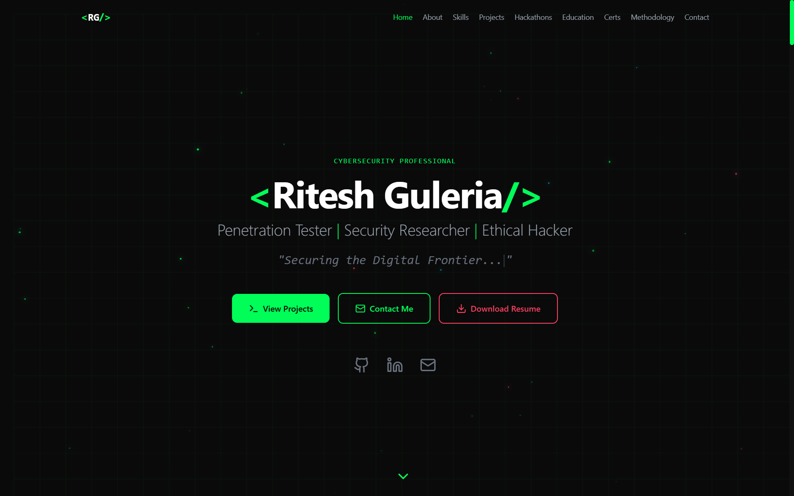

# Ritesh Guleria - Cybersecurity Portfolio

[](https://2r3m4yzocqksc.ok.kimi.link)
[](https://reactjs.org/)
[](https://www.typescriptlang.org/)
[](https://tailwindcss.com/)
[](https://vitejs.dev/)

> A modern, responsive portfolio website for a Cybersecurity Specialist and Penetration Tester.



## 🚀 Live Demo

**🔗 [View Live Portfolio](https://2r3m4yzocqksc.ok.kimi.link)**

---

## ✨ Features

- **Modern Tech Stack**: Built with React, TypeScript, Vite, and Tailwind CSS
- **Smooth Animations**: Framer Motion animations throughout the site
- **Fully Responsive**: Optimized for desktop, tablet, and mobile devices
- **Dark Theme**: Cybersecurity-inspired dark theme with neon green accents
- **Interactive Sections**:
  - Hero with typing animation
  - About with TryHackMe badge integration
  - Skills & Tooling showcase
  - Projects with GitHub links
  - Hackathon Experience
  - Education & Certifications (separate sections)
  - Methodology & Ethics
  - Contact form
- **Scroll Progress Bar**: Visual indicator of scroll position
- **Active Navigation**: Highlights current section while scrolling

---

## 🛠 Tech Stack

| Category | Technology |
|----------|------------|
| Framework | [React](https://reactjs.org/) |
| Language | [TypeScript](https://www.typescriptlang.org/) |
| Build Tool | [Vite](https://vitejs.dev/) |
| Styling | [Tailwind CSS](https://tailwindcss.com/) |
| Animations | [Framer Motion](https://www.framer.com/motion/) |
| Icons | [Lucide React](https://lucide.dev/) |
| UI Components | [shadcn/ui](https://ui.shadcn.com/) |

---

## 📦 Installation

### Prerequisites

- Node.js 18+ 
- npm or yarn

### Setup

1. **Clone the repository**
   ```bash
   git clone https://github.com/cybergeek-007/portfolio.git
   cd portfolio
   ```

2. **Install dependencies**
   ```bash
   npm install
   # or
   yarn install
   ```

3. **Start development server**
   ```bash
   npm run dev
   # or
   yarn dev
   ```

4. **Open in browser**
   Navigate to `http://localhost:5173`

---

## 🔨 Build for Production

```bash
npm run build
# or
yarn build
```

The built files will be in the `dist/` directory.

---

## 📁 Project Structure

```
portfolio/
├── public/
│   └── ...                 # Static assets
├── src/
│   ├── components/         # Reusable components
│   ├── sections/           # Page sections
│   ├── hooks/              # Custom React hooks
│   ├── types/              # TypeScript types
│   ├── App.tsx             # Main app component
│   ├── index.css           # Global styles
│   └── main.tsx            # Entry point
├── index.html              # HTML template
├── tailwind.config.js      # Tailwind configuration
├── vite.config.ts          # Vite configuration
├── tsconfig.json           # TypeScript configuration
└── package.json            # Dependencies
```

---

## 🎨 Color Palette

| Color | Hex | Usage |
|-------|-----|-------|
| Primary Green | `#00ff41` | Accent, buttons, highlights |
| Primary Blue | `#00d9ff` | Secondary accent |
| Primary Red | `#ff3864` | Warnings, emphasis |
| Background | `#0a0a0a` | Main background |
| Card Background | `#1a1a1a` | Card backgrounds |
| Text Primary | `#e0e0e0` | Main text |
| Text Secondary | `#9ca3af` | Muted text |

---

## 📱 Sections

1. **Hero** - Introduction with animated typing effect
2. **About** - Bio with TryHackMe badge integration
3. **Skills** - Technical skills organized by category
4. **Projects** - Security tools with GitHub links
5. **Hackathons** - CTF and hackathon experiences
6. **Education** - Academic qualifications
7. **Certifications** - Professional certifications
8. **Methodology** - Pentesting methodology & ethics
9. **Contact** - Contact form and social links

---

## 🚀 Deployment


To deploy your own version:

1. Build the project: `npm run build`
2. Deploy the `dist/` folder to your preferred hosting platform:
   - [Vercel](https://vercel.com/)
   - [Netlify](https://www.netlify.com/)
   - [GitHub Pages](https://pages.github.com/)
   - [Cloudflare Pages](https://pages.cloudflare.com/)

---

## 📝 Customization

### Updating Personal Information

Edit the data in `src/App.tsx`:

- **Projects**: Update the `projects` array
- **Hackathons**: Update the `hackathons` array
- **Education**: Update the `education` array
- **Certifications**: Update the `certifications` array
- **Skills**: Update the `skills` array

### Updating TryHackMe Badge

Replace the iframe URL in the About section with your own:
```tsx
<iframe 
  src="https://tryhackme.com/api/v2/badges/public-profile?userPublicId=YOUR_ID" 
  ...
/>
```

### Updating Social Links

Find and replace social URLs in:
- Hero section
- Contact section
- Footer

---

## 📄 License

This project is open source and available under the [MIT License](LICENSE).

---

## 📧 Contact

**Ritesh Guleria**

- 📧 Email: [guleriaritesh2@gmail.com](mailto:guleriaritesh2@gmail.com)
- 💼 LinkedIn: [linkedin.com/in/riteshguleria007](https://www.linkedin.com/in/riteshguleria007)
- 🐙 GitHub: [github.com/cybergeek-007](https://github.com/cybergeek-007)
- 🏆 TryHackMe: [tryhackme.com/p/YOUR_USERNAME](https://tryhackme.com)

---

<p align="center">
  Made with 💚 by <strong>Ritesh Guleria</strong>
</p>
