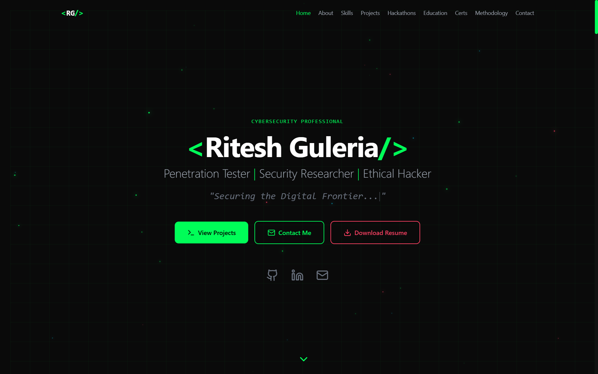

<p align="center">
  
</p>

<h1 align="center">Ritesh Guleria — Cybersecurity Portfolio</h1>

<p align="center">
  <strong>A sleek, responsive portfolio website for a Cybersecurity Specialist & Penetration Tester</strong>
</p>

<p align="center">
  <a href="https://riteshguleriacv.vercel.app"></a>
  <a href="https://github.com/cybergeek-007"></a>
  <a href="https://www.linkedin.com/in/riteshguleria007"></a>
</p>

<p align="center">
  
  
  
  
  
</p>

---

## 📸 Preview



---

## ✨ Highlights

| Feature | Details |
|---------|---------|
| **Single-Page App** | All sections live in one smooth-scrolling page with intersection-based active nav |
| **Dark Cyber Theme** | Neon green (`#00ff41`), electric blue (`#00d9ff`), and crimson (`#ff3864`) accents on a `#0a0a0a` canvas |
| **Framer Motion** | Fade-in, stagger, and scroll-based animations for every section |
| **Fully Responsive** | Mobile-first layout with a hamburger menu and adaptive typography |
| **Contact Form** | Powered by [Formspree](https://formspree.io/) with email domain validation, HTML sanitization, and client-side rate limiting |
| **TryHackMe Card** | Compact inline profile card linking to TryHackMe stats |
| **GitHub Projects** | Four featured projects with live-demo links where available |
| **Scroll Progress Bar** | A fixed top bar showing page scroll percentage |

---

## 🗂 Sections

1. **Hero** — Animated intro with *View Projects*, *Contact Me*, and *Download Resume* CTAs
2. **About** — Bio, TryHackMe profile card, and Core Philosophy pillars
3. **Skills** — Categorised skill grid (Offensive Security, SIEM & Monitoring, Networking, Dev & Scripting)
4. **Projects** — PhishGuard · ManifestGuard · PulseWatch · LogisTech
5. **Hackathons** — SIH 2024 · Winja CTF Nullcon Goa 2026 · TryHackMe Advent of Cyber 2025 · CodeVinci CTF 2026
6. **Education** — B.Tech CSE (Cyber Security) @ Chitkara University · Senior Secondary @ St. Xavier's School
7. **Certifications** — Google Cybersecurity · Ethical Hacking (NPTEL) · Microsoft Azure (Wipro COE) · Cisco Networking
8. **Methodology & Ethics** — Five-phase pentesting methodology with an ethics commitment
9. **Contact** — Formspree-powered form + social links

---

## 🛠 Tech Stack

| Layer | Technology |
|-------|------------|
| UI Framework | React 19 |
| Language | TypeScript 5.9 |
| Build Tool | Vite 7 |
| Styling | Tailwind CSS 3 + tailwindcss-animate |
| Animations | Framer Motion 12 |
| Icons | Lucide React |
| UI Primitives | Radix UI (via shadcn/ui) |
| Form Handling | React Hook Form + Zod + Formspree |
| Deployment | Vercel |

---

## 🚀 Getting Started

### Prerequisites

- **Node.js** ≥ 18
- **npm** (comes with Node) or **yarn**

### Installation

```bash
# 1. Clone the repo
git clone https://github.com/cybergeek-007/cybersecurity-portfolio-mern.git
cd cybersecurity-portfolio-mern

# 2. Install dependencies
npm install

# 3. Start the dev server
npm run dev
```

Open **http://localhost:5173** in your browser.

### Build for Production

```bash
npm run build      # TypeScript compile + Vite build
npm run preview    # Preview the production build locally
```

The optimised output is written to the `dist/` directory.

---

## 📁 Project Structure

```
├── public/
│   ├── favicon.svg         # Custom <RG/> SVG favicon
│   └── resume.pdf          # Downloadable resume
├── src/
│   ├── components/ui/      # shadcn/ui primitives (button, card, dialog, etc.)
│   ├── hooks/
│   │   └── use-mobile.ts   # Responsive breakpoint hook
│   ├── lib/
│   │   └── utils.ts        # Tailwind merge helper (cn)
│   ├── App.tsx             # Main single-page application (~1378 lines)
│   ├── index.css           # Tailwind directives + custom styles
│   └── main.tsx            # React DOM entry point
├── index.html              # HTML shell with favicon
├── tailwind.config.js      # Tailwind theme & plugins
├── vite.config.ts          # Vite configuration
├── tsconfig.json           # TypeScript config (root)
├── tsconfig.app.json       # TypeScript config (app source)
├── tsconfig.node.json      # TypeScript config (node/vite)
├── eslint.config.js        # ESLint flat config
├── postcss.config.js       # PostCSS (Tailwind + Autoprefixer)
├── components.json         # shadcn/ui configuration
└── package.json
```

---

## 🎨 Design Tokens

| Token | Value | Usage |
|-------|-------|-------|
| Primary Green | `#00ff41` | Accents, CTAs, skill highlights |
| Electric Blue | `#00d9ff` | Secondary accent, live-demo links |
| Crimson Red | `#ff3864` | Warnings, resume button, emphasis |
| Background | `#0a0a0a` | Page background |
| Surface | `#111111` / `#1a1a1a` | Section & card backgrounds |
| Text Primary | `#e0e0e0` | Body text |
| Text Muted | `#9ca3af` | Subtitles, descriptions |

---

## ⚙️ Configuration

### Contact Form (Formspree)

The contact form submits to a Formspree endpoint. To use your own:

1. Create a form at [formspree.io](https://formspree.io/)
2. Replace the endpoint URL in the `ContactSection` component inside `src/App.tsx`:
   ```tsx
   const response = await fetch('https://formspree.io/f/YOUR_FORM_ID', { ... });
   ```

### Resume

Replace `public/resume.pdf` with your own resume file.

### TryHackMe

Update the `publicId` and username in the `AboutSection` of `src/App.tsx` to reflect your own TryHackMe profile.

---

## 🚢 Deployment

The site is deployed on **Vercel** with zero configuration:

1. Push to GitHub
2. Import the repo on [vercel.com](https://vercel.com/)
3. Vercel auto-detects Vite and deploys on every push

Other supported platforms: **Netlify**, **Cloudflare Pages**, **GitHub Pages** (serve the `dist/` folder).

---

## 📜 License

This project is open-source and available under the [MIT License](LICENSE).

---

<p align="center">
  Made with 💚 by <strong>Ritesh Guleria</strong>
</p>
